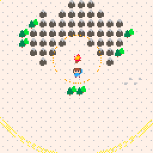

# Global Game Jam 2019

Global Game Jam 2019 project, made with [PICO-8](https://www.lexaloffle.com/pico-8.php).
The theme is **“what home means to you”**.

Brave the harsh cold by building campfires and find your way “home”.
Use arrows to move, Z (“O” button in PICO-8) to build and X to chop.

## Installation

Download the binaries (ggj19.zip, NOT the source code) from the [releases page](https://github.com/majorcob/ggj19/releases).
Make sure to fully extract the archive before running the executable!

## License

[CC BY-NC-SA 4.0](https://creativecommons.org/licenses/by-nc-sa/4.0/)

